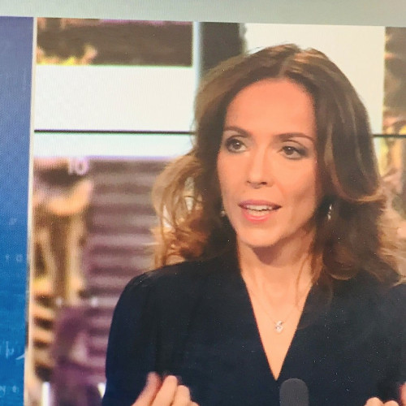
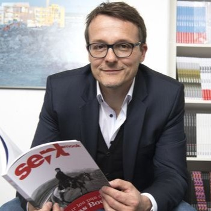
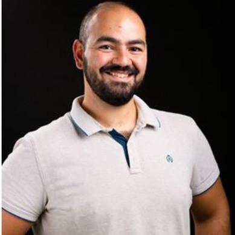
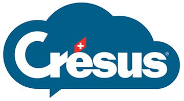

# Game Jam: Focus on Information & Media Innovation

Come join us for an exciting 24-hour game jam exploring the theme of information, fact-checking, and combating deepfakes! Build innovative prototypes and compete for amazing prizes 🎮🎉

[1. General Information](#1-general-information)  
[2. Themes](#2-themes)  
[3. Schedule](#4-schedule)  
[4. Team Formation](#5-team-formation)  
[5. Submission Process](#6-submission-process)  
[6. Communication](#7-communication)  
[7. Guidelines](#8-guidelines)  
[8. Evaluation Criteria](#9-evaluation-criteria)  
[9. Jury](#10-jury)  
[10. Acknowledgements](#11-acknowledgements)
## 1. General Information

### **Date & Time:**
- **Date:** Friday, September 27 to Saturday, September 27 
- **Time:** 5:00 PM (Sep 27) to 8:00 PM (Sep 28)

### **Location:**
  - [BC Building, 4th floor](https://www.google.com/maps/place/BC+Building+(building+of+the+IC+faculty)/@46.5188791,6.5627602,18z/data=!4m6!3m5!1s0x478c30fcd9c6f5b3:0xd37877e203e479a8!8m2!3d46.518569!4d6.561918!16s%2Fg%2F1pv1l1jcp?entry=ttu) (IC Faculty Building)  
  - Chem. Alan Turing, 1015 Ecublens, Switzerland 

## 2. Themes

This game jam, co-organized by the Initiative for Media Innovation (IMI) and InForm, will focus on the **theme of information**. Key topics could include:  
- Fact-checking  
- Combating deepfakes  
- Promoting digital literacy  
- Enhancing transparency in media  

Teams will have 24 hours to design and prototype a game that addresses one or more of these critical topics. The game jam will be guided by a video game designer, a journalist, and other experts from the IT industry.

## 3. Schedule

**Friday, [Event Date]:**  
  - **5:00 PM:** Participant Check-in  
  - **5:10 PM:** Welcome remarks by IMI and EPFL  
  - **5:20 PM:** Introduction of the theme by InForm  
  - **5:35 PM:** Showcase of games from ISART Digital's GameWeek  
  - **5:50 PM:** Presentation of the Game Jam and Challenge by GameLab UNIL-EPFL  
  - **6:05 PM:** Team Formation  
  - **6:15 PM:** Start of Game Jam (Max 5 people per team)  

**Saturday, [Event Date]:**  
  - **Throughout the day:** Game Jam continues with meals and beverages provided.  
  - **5:00 PM:** Pitch session to the jury followed by prize announcements.

Free food and drinks will be provided throughout the event!  
The event concludes with a final pitch session where 3 winners will be selected and awarded exciting prizes such as CHF 3,000 worth of gaming gear, game keys, and more!

## 4. Team Formation

Teams can consist of up to 5 members. Please form your teams on-site after the event introduction or use our [team formation document](https://docs.google.com/spreadsheets/d/1M_2P2imvVXc_p9r-7N2kCKn2dNCar32lAjfiD9ROvnA/edit?usp=sharing).

## 5. Submission Process

All game prototypes should be submitted via DevPost (TBA) by the end of the Game Jam. Submissions should include:

1. A playable demo or video showcasing the game
2. A brief description of the game and its relevance to the theme
3. A GitHub repository (or equivalent) containing the codebase

To be eligible for prizes, each team must present their game in a 5-minute pitch session to the jury on Saturday afternoon.

## 6. Communication (Discord)

Real-time updates and event communication will be managed through our [Discord server](https://discord.gg/invite-link). Join the 
**#gamejam-sep2024** channel to stay updated on event announcements, ask questions, and coordinate with your team.

## 7. Evaluation Criteria

Projects will be evaluated based on the following criteria:

| **Criteria**                               | **Points** |
|--------------------------------------------|------------|
| **1. Technical Complexity**                | 6          |
| **2. Creativity and Originality**           | 6          |
| **3. Relevance to the Theme**              | 8          |
| **4. Playability and User Experience**     | 4          |

Total points: **24**

### Bonus:
- **Use of innovative media technologies (e.g., AI, VR)** will be highly regarded by the jury.
## 8. Guidelines

General Guidelines are provided by the [LauzHack rules](https://lauzhack.com/pdf/rules.pdf)
## 9. Jury

  <table style="margin-left: auto; margin-right: auto;">
    <tbody>
      <tr>
        <td align="center" valign="top" width="16%">
          <a href="https://www.linkedin.com/in/mkrichane/">
            
             <b>Mounir Krichane</b>
          </a>
        </td>
        <td align="center" valign="top" width="16%">
          <a href="https://www.linkedin.com/in/gaelhurlimann/">
            
             <b>Gaël Hurlimann</b>
          </a>
        </td>
        <td align="center" valign="top" width="16%">
          <a href="https://www.linkedin.com/in/isaacpante/">
            
             <b>Isaac Pante</b>
          </a>
        </td>
        <td align="center" valign="top" width="16%">
          <a href="https://www.linkedin.com/in/karinepapillaud/">
            
             <b>Karine Papillaud</b>
          </a>
        </td>
      </tr>
    </tbody>
  </table>

  <table style="margin-left: auto; margin-right: auto;">
    <tbody>
      <tr>
        <td align="center" valign="top" width="16%">
          <a href="https://www.linkedin.com/in/patrick-vallélian-a0769a13/">
            
             <b>Patrick Vallélian</b>
          </a>
        </td>
        <td align="center" valign="top" width="16%">
          <a href="https://www.linkedin.com/in/maël-addoum/">
            
             <b>Maël Addoum</b>
          </a>
        </td>
        <td align="center" valign="top" width="16%">
          <a href="https://www.linkedin.com/in/hassane-assendal/">
            
             <b>Hassane Assendal</b>
          </a>
        </td>
        <td align="center" valign="top" width="16%">
          <a href="https://cresus.ch/fr/a-propos">
            
             <b>Olivier Michel</b>
          </a>
        </td>
      </tr>
    </tbody>
  </table>

## 9. Acknowledgements

This event is co-organized by the Initiative for Media Innovation (IMI) and InForm, in collaboration with:

- GameLab UNIL-EPFL  
- ISART Digital  
- LauzHack  

Special thanks to our sponsors: Crésus, ELCA, Logitech, and Alp-ICT.

Let’s build something amazing together! 👾
